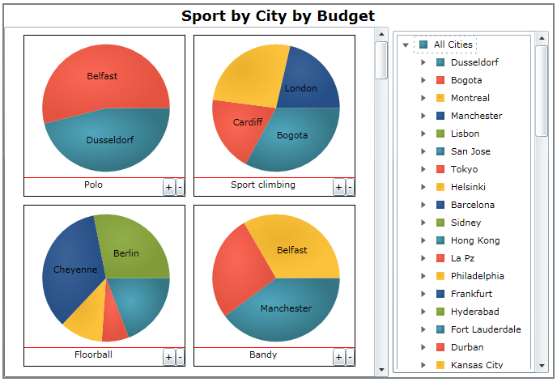

////
|metadata|
{
    "name": "piechart-binding-olap-data",
    "controlName": ["{PieChartName}"],
    "tags": ["Charting","Getting Started","Layouts"],
    "guid": "72ea0f26-9bdb-4459-a24f-729f6343de37",
    "buildFlags": ["SL","WPF"],
    "createdOn": "2014-06-05T19:53:12.0859032Z"
}
|metadata|
////

= Binding OLAP Data

=== Purpose

Demonstrates how to configure the link:{PieChartLink}.{PieChartName}.html[{PieChartName}]™ control for displaying OLAP data.

=== Required background

Prerequisite materials required to understand this topic.

[options="header", cols="a,a"]
|====
|Type|Content

|Concepts
|
* link:http://msdn.microsoft.com/en-US/library/ms175367(v=SQL.90).aspx[OLAP] (Online Analytical Processing) 
|====

[options="header", cols="a,a"] 

|==== 

|Topic|Purpose 

| link:piechart.html[{PieChartName}] 

|The is a specialized control for rendering pie charts, a circle divided into slices; each having an arc length proportional to its underlying data value. 

| link:piechart-visualizing-olap-data-piechart.html[Visualizing OLAP Data] 

|This topic explains the specifics of using the _{PieChartName}_ control with OLAP data. 

|====

=== In this topic

This topic contains the following sections:

* <<OLE_LINK26,Using the {PieChartName} with OLAP Data>>

** <<_Ref321135670,OLAP Visuals>>
** <<_Ref321135684,Supported OLAP data types>>
** <<_Ref321135696,Property Settings>>
** <<_Ref321135704,Code Example>>

* <<_Ref321135713,Related Content>>

== Using the {PieChartName} with OLAP Data

[[_Ref321135670]]

=== OLAP Visuals

Visualizing OLAP data with _{PieChartName}_ is done through a new axis type called link:{ApiPlatform}controls.charts.olap{ApiVersion}{PieChartNamespace}.olapaxis_members.html[OlapAxis].

OlapAxis consists of two key properties link:{ApiPlatform}controls.charts.olap{ApiVersion}{PieChartNamespace}.olapaxis~datasource.html[DataSource] and link:{ApiPlatform}controls.charts.olap{ApiVersion}{PieChartNamespace}.olapaxis~olapaxissource.html[OlapAxisSource].

DataSoure is used for data binding, and OlapAxisSource is used for determining the axis type in data rendering. It is important to set up both of these properties in order to visualize the OLAP data with a pie chart.

The axis type can be either _Columns_ or _Rows_ , referring to the columns or rows from the data source.

Each column in the data source is rendered as an individual pie chart whose rows are represented by the slices; as illustrated below.

The _{PieChartName}_ control renders data containing multiple columns as multiple pie charts, one for each column from the data source. As with the previous example, the column’s rows are rendered as the slices in the correspond pies. This behavior is illustrated in the following screen shot.

By default the pie chart displays one column dimension with one row dimension, meaning one pie chart. The columns and rows are not expanded.

For more details, refer to link:piechart-user-interactions-with-olap-data.html[User Interactions with OLAP Data].

[[_Ref321135684]]

=== Supported OLAP data types

The only supported data source types are:

* link:http://msdn.microsoft.com/en-us/library/ms187178(v=SQL.90).aspx[XMLA]

* link:{ApiPlatform}olap.flatdata{ApiVersion}~infragistics.olap.flatdata.flatdatasource_members.html[FlatDataSource]

[[_Ref321135696]]

=== Property Settings

The minimum required property settings for displaying a pie chart with OLAP data.

[options="header", cols="a,a,a"]
|====
|In order to:|Use this property:|And set it to:

|Set the data binding with OLAP data source
| link:{ApiPlatform}controls.charts.olap{ApiVersion}{PieChartNamespace}.olapaxis~datasource.html[DataSource]
|Your OLAP data

|Specify the axis type
| link:{ApiPlatform}controls.charts.olap{ApiVersion}{PieChartNamespace}.olapaxis~olapaxissource.html[OlapAxisSource]
|Columns or Rows

|====

=== Code Example

This coding example demonstrates the minimum _{PieChartName}_ control’s property settings required to display OLAP data.

ifdef::xaml[]

*In XAML:*

[source,xaml]
----
<ig:XamOlapPieChart 
    DataSource="{Binding DataSource}" 
    OlapAxisSource="Columns" />
----

endif::xaml[]

ifdef::xaml[]

*In C#:*

[source,csharp]
----
XamOlapPieChart chart = new XamOlapPieChart();
chart.DataSource = new MainViewModel().DataSource;
chart.OlapAxisSource = OlapAxisSource.Columns;
----

endif::xaml[]

ifdef::win-forms[]

*In C#:*

[source,csharp]
----
XamOlapPieChart chart = new XamOlapPieChart();
chart.DataSource = new MainViewModel().DataSource;
chart.OlapAxisSource = OlapAxisSource.Columns;
----

endif::win-forms[]

ifdef::xaml[]

*In Visual Basic:*

[source,vb]
----
Dim chart As New XamOlapPieChart()
chart.DataSource = New MainViewModel().DataSource
chart.OlapAxisSource = OlapAxisSource.Columns
----

endif::xaml[]

ifdef::win-forms[]

*In Visual Basic:*

[source,vb]
----
Dim chart As New XamOlapPieChart()
chart.DataSource = New MainViewModel().DataSource
chart.OlapAxisSource = OlapAxisSource.Columns
----

endif::win-forms[]

[[_Ref321135713]]
== Related Content

=== Topics

The following topics provide additional information related to this topic.

[options="header", cols="a,a"]
|====
|Topic|Purpose

| link:piechart-user-interactions-with-olap-data.html[User Interactions with OLAP Data]
|This topic illustrates how to visualize OLAP data using the {PieChartName} control.

|====