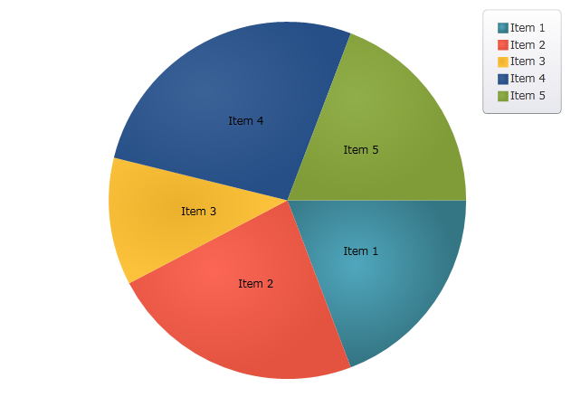
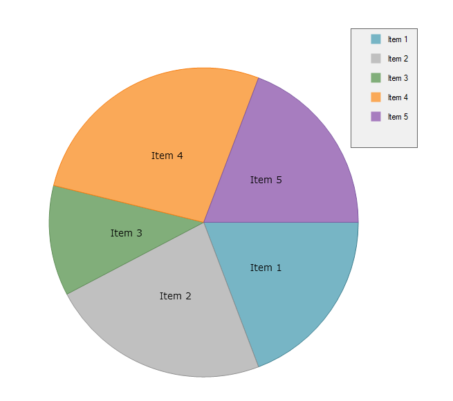

////
|metadata|
{
    "name": "piechart-data-binding",
    "controlName": ["{PieChartName}"],
    "tags": ["Data Binding"],
    "guid": "8a5963d0-af62-4426-8aeb-547da883d52d",
    "buildFlags": ["SL","WPF","win-phone","XAMARIN","ANDROID","WINFORMS"],
    "createdOn": "2014-06-05T19:53:12.0748984Z"
}
|metadata|
////

= Data Binding

This topic demonstrates how to bind data to the link:{PieChartLink}.{PieChartName}.html[{PieChartName}]™ control. At the end of the topic, a complete code sample is provided.

The topic is organized as follows:

* <<Introduction,Introduction>>
* <<Preview,Preview>>
* <<Requirements,Requirements>>
* <<Overview,Overview>>
* <<Steps,Steps>>
* <<RelatedTopics,Related Topics>>

[[Introduction]]
== Introduction

The procedure below demonstrates how to bind the {PieChartName} control to a data collection.  pick:[xaml="You will define a data collection, add the Pie Chart control to your application, and then bind the control’s"]   pick:[xaml=" link:{PieChartLink}.{PieChartBase}~itemssource.html[ItemsSource]"]   pick:[xaml="to an instance of the data collection."]

[[Preview]]
== Preview

ifdef::android,xaml[]

endif::android,xaml[]

ifdef::win-forms[]

endif::win-forms[]

Figure 1: The {PieChartName} control as implemented by the sample code

[[Requirements]]
== Requirements

Required  pick:[xaml,win-forms="assembly references"]  pick:[android="jars"] :

*  pick:[xaml="Add the following Infragistics assemblies to the *SampleApp* project:"]   pick:[android="Add the following Infragistics jars to the *SampleApp* project:"]   pick:[win-forms="Add the following Infragistics assemblies:"] 

ifdef::android[]
** Infragistics.DataChart.jar

endif::android[]

ifdef::android[]
** DV.Shared jar

endif::android[]

ifdef::android[]
** Infragistics.Core.jar

endif::android[]

ifdef::android[]
** Infragistics.UI.jar

endif::android[]

ifdef::xaml,win-forms[]
** {ApiPlatform}{PieChartAssembly}{ApiVersion}.dll

endif::xaml,win-forms[]

ifdef::xaml,win-forms[]
** {ApiPlatform}DataVisualization{ApiVersion}.dll

endif::xaml,win-forms[]

ifdef::win-forms[]
** {ApiPlatform}Win.Portable.Core{ApiVersion}.dll

endif::win-forms[]

ifdef::xamarin[]
** {ApiPlatform}Controls.Charts{ApiVersion}.dll

endif::xamarin[]

ifdef::xamarin[]
** {ApiPlatform}{ApiVersion}dll

endif::xamarin[]

ifdef::xamarin[]
* Add the following Infragistics assemblies to the *SampleApp.iOS* project:

** {ApiPlatform}Controls.Charts.{ApiVersion}iOS.dll
** {ApiPlatform}iOS.dll

endif::xamarin[]

ifdef::xamarin[]
* Add the following Infragistics assemblies to the *SampleApp.Android* project:

** {ApiPlatform}Controls.Charts.{ApiVersion}Android.dll
** {ApiPlatform}Android.dll

endif::xamarin[]

ifdef::xaml[]

*In XAML:*

----
xmlns:ig="http://schemas.infragistics.com/xaml"
xmlns:local="clr-namespace;SampleApp;assembly=SampleApp"
----

endif::xaml[]

ifdef::xamarin[]

*In XAML:*

----
xmlns:ig="clr-namespace:Infragistics.XF.Controls;assembly={ApiPlatform}Controls.Charts"
xmlns:local="clr-namespace:SampleApp;assembly=SampleApp"
----

endif::xamarin[]

ifdef::android[]

*In Java:*

[source,js]
----
import com.infragistics.controls.PieChartView;
----

endif::android[]

ifdef::win-forms[]

*In C#:*

[source,csharp]
----
using Infragistics.Win.DataVisualization.UltraDataChart; 
using Infragistics.Win.DataVisualization.Shared; 
using Infragistics.Win.Portable.Core;
----

endif::win-forms[]

ifdef::win-forms[]

*In VB:*

[source,vb]
----
Imports Infragistics.Win.DataVisualization.UltraDataChart 
Import Infragistics.Win.DataVisualization.Shared 
Import Infragistics.Win.Portable.Core
----

endif::win-forms[]

[[Overview]]
== Overview

[start=1]
. Defining a Data Model
[start=2]
. Adding an Instance of the Pie Chart control
[start=3]
. (Optional) Verifying the result

[[Steps]]
== Steps

[start=1]
. *Define a Data Model* .

Create a class to model the data. The following code creates a DataItem class representing simple value-label pairs, as well as a Data class representing a collection of those pairs:

ifdef::xaml[]

*In C#:*

----
    public class DataItem
    {
        public string Label { get; set; }
        public double Value { get; set; }
    }
    public class Data : ObservableCollection<DataItem>
    {
        public Data()
        {
            Add(new DataItem { Label = "Item 1", Value = 5 });
            Add(new DataItem { Label = "Item 2", Value = 6 });
            Add(new DataItem { Label = "Item 3", Value = 3 });
            Add(new DataItem { Label = "Item 4", Value = 7 });
            Add(new DataItem { Label = "Item 5", Value = 5 });
        }
    }
----

endif::xaml[]

ifdef::win-forms[]

*In C#:*

----
    public class DataItem
    {
        public string Label { get; set; }
        public double Value { get; set; }
    }
    public class Data : ObservableCollection<DataItem>
    {
        public Data()
        {
            Add(new DataItem { Label = "Item 1", Value = 5 });
            Add(new DataItem { Label = "Item 2", Value = 6 });
            Add(new DataItem { Label = "Item 3", Value = 3 });
            Add(new DataItem { Label = "Item 4", Value = 7 });
            Add(new DataItem { Label = "Item 5", Value = 5 });
        }
    }
----

endif::win-forms[]

ifdef::xaml[]

*In Visual Basic:*

----
Public Class DataItem    
   Public Property Label() As String 
      Get          
         Return _Label        
       End Get     
       Set            
          _Label = Value          
       End Set    
    End Property  
    Private _Label As String    
    Public Property Value() As Double 
       Get    
          Return _Value         
       End Get        
       Set    
          _Value = Value         
       End Set      
    End Property    
    Private _Value As Double   
End Class    
Public Class Data    
   Inherits ObservableCollection(Of DataItem)       
   Public Sub New()   
      Add(New DataItem() With { .Label = "Item 1", .Value = 5 })         
      Add(New DataItem() With { .Label = "Item 2", .Value = 6 })           
      Add(New DataItem() With { .Label = "Item 3", .Value = 3 })           
      Add(New DataItem() With { .Label = "Item 4", .Value = 7 })           
      Add(New DataItem() With { .Label = "Item 5", .Value = 5 })           
   End Sub  
 End Class
----

endif::xaml[]

ifdef::win-forms[]

*In Visual Basic:*

----
Public Class DataItem    
   Public Property Label() As String 
      Get          
         Return _Label        
       End Get     
       Set            
          _Label = Value          
       End Set    
    End Property  
    Private _Label As String    
    Public Property Value() As Double 
       Get    
          Return _Value         
       End Get        
       Set    
          _Value = Value         
       End Set      
    End Property    
    Private _Value As Double   
End Class    
Public Class Data    
   Inherits ObservableCollection(Of DataItem)       
   Public Sub New()   
      Add(New DataItem() With { .Label = "Item 1", .Value = 5 })         
      Add(New DataItem() With { .Label = "Item 2", .Value = 6 })           
      Add(New DataItem() With { .Label = "Item 3", .Value = 3 })           
      Add(New DataItem() With { .Label = "Item 4", .Value = 7 })           
      Add(New DataItem() With { .Label = "Item 5", .Value = 5 })           
   End Sub  
 End Class
----

endif::win-forms[]

ifdef::android[]

*In Java:*

[source,js]
----
public class DataItem { 
private String _label; 
public String getLabel() { 
return _label; 
 } 
public void setLabel(String label) {
_label = label;
} 
private double _value;
public double getValue(){ 
return _value; 
}
public void setValue(double value) {
_value = value; 
} 
public DataItem(String label, double value){ 
_label = label; 
_value = value; 
}
}
public class Data extends ArrayList<DataItem> {
public Data() { 
add(new DataItem("Item 1", 5));
add(new DataItem("Item 2", 6));
add(new DataItem("Item 3", 3));
add(new DataItem("Item 4", 7)); 
add(new DataItem("Item 5", 5)); 
}
}
----

endif::android[]

[start=2]
. *Add an instance of the {PieChartName} Control* .

To the  pick:[xaml,android="layout root"]  pick:[win-forms="form"] , add an instance of the data collection, a legend instance, and an instance of the Pie Chart:

ifdef::xaml[]

*In XAML:*

----
    <Grid x:Name="LayoutRoot" >
        <Grid.Resources>
            <local:Data x:Key="data" />
        </Grid.Resources>
        <ig:ItemLegend x:Name="Legend"
                       Grid.Row="1"
                       VerticalAlignment="Top"
                       HorizontalAlignment="Right"  />
        <ig:{PieChartName} Name="pieChart"
                       Grid.Row="2"
                       ItemsSource="{StaticResource data}"
                       LabelMemberPath="Label"
                       ValueMemberPath="Value"
                       Legend="{Binding ElementName=Legend}"/>
    </Grid>
----

endif::xaml[]

ifdef::xamarin[]

*In XAML:*

----
    <Grid x:Name="LayoutRoot" >
        <Grid.Resources>
            <local:Data x:Key="data" />
        </Grid.Resources>
        <ig:XFItemLegend x:Name="Legend"
                       Grid.Row="1"
                       VerticalAlignment="Top"
                       HorizontalAlignment="Right"  />
        <ig:XFPieChart Name="pieChart"
                      Grid.Row="2"
                      ItemsSource="{StaticResource data}"
                      LabelMemberPath="Label"
                      ValueMemberPath="Value" 
                        Legend="{x:Reference Legend}"/>
    </Grid>
----

endif::xamarin[]

ifdef::android[]

*In Java:*

[source,js]
----
public class MainActivityFragment extends Fragment {
public MainActivityFragment() {
}
@Override
public View onCreateView(LayoutInflater inflater, ViewGroup container,                             Bundle savedInstanceState) {
View rootView = inflater.inflate(R.layout.fragment_main, container, false); 
Context context = rootView.getContext();
Data data = new Data(); 
PieChartView pieChart = new PieChartView(context);
RelativeLayout.LayoutParams chartParams = new RelativeLayout.LayoutParams(RelativeLayout.LayoutParams.MATCH_PARENT,RelativeLayout.LayoutParams.MATCH_PARENT);
pieChart.setLayoutParams(chartParams);
ItemLegendView legend = new ItemLegendView(context);
FrameLayout.LayoutParams legendParams = new FrameLayout.LayoutParams(FrameLayout.LayoutParams.WRAP_CONTENT,FrameLayout.LayoutParams.WRAP_CONTENT);        legendParams.gravity = Gravity.TOP | Gravity.LEFT;
legend.setLayoutParams(legendParams);
pieChart.setLegend(legend);
pieChart.setDataSource(data);
pieChart.setLabelMemberPath("Label");
pieChart.setValueMemberPath("Value");
return pieChart;
}
}
----

endif::android[]

ifdef::win-forms[]

*In C#:*

[source,csharp]
----
UltraPieChart pieChart = new UltraPieChart();
this.Controls.Add(pieChart);
pieChart.Dock = DockStyle.Fill;
pieChart.LabelMemberPath = "Label";
pieChart.ValueMemberPath = "Value";
pieChart.DataSource = new Data(); 
UltraItemLegend legend = new UltraItemLegend();
this.Controls.Add(legend);
legend.Dock = DockStyle.Right;
legend.Height = 500;
pieChart.Legend = legend;
legend.BringToFront();
----

endif::win-forms[]

ifdef::win-forms[]

*In VB:*

[source,vb]
----
Dim pieChart As New UltraPieChart ()
Me.Controls.Add(pieChart)
pieChart.Dock = DockStyle.Fill
pieChart.LabelMemberPath = "Label"
pieChart.ValueMemberPath = "Value"
pieChart.DataSource = New Data ()  
Dim legend As New UltraItemLegend()
legend.Dock = DockStyle.Right
legend.Height = 500
pieChart.Legend = legend
legend.BringToFront()
----

endif::win-forms[]

[start=3]
. *(Optional) Verify the Result* .

Run your application to verify the result. If you have successfully bound the Pie Chart control to the data collection, the resulting chart will look like the one shown in Figure 1, above.

[[RelatedTopics]]
== Related Topics

* link:piechart-others-category.html[Others Category]
* link:piechart-selection-and-explosion.html[Selection and Explosion]