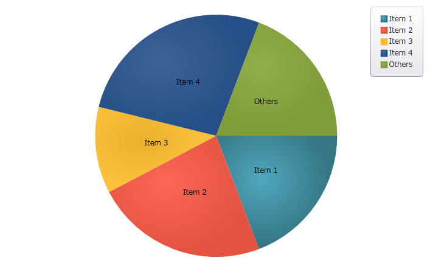
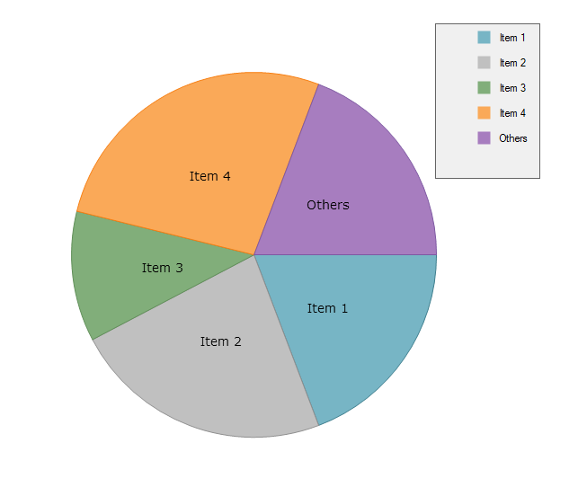
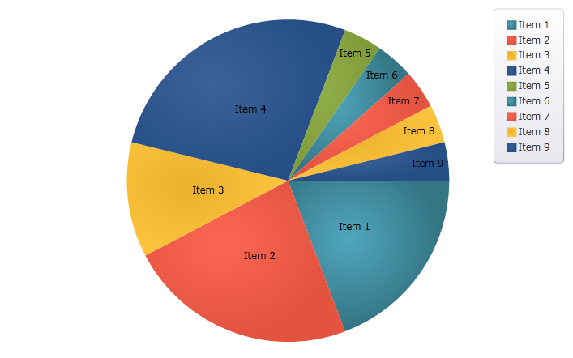
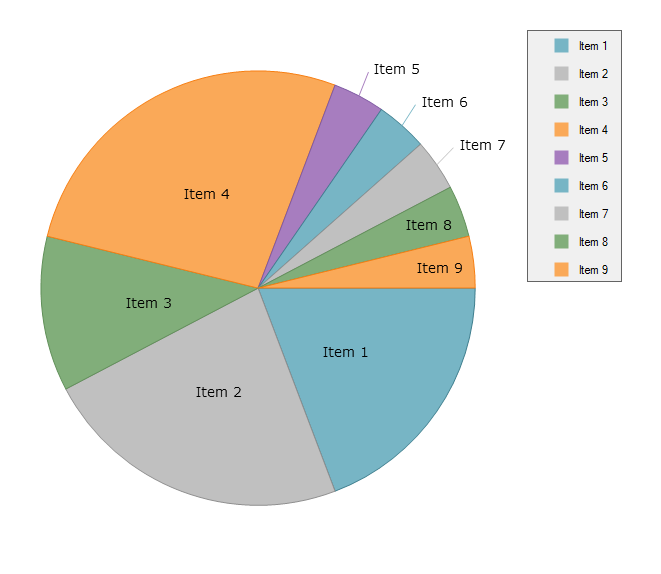

////
|metadata|
{
    "name": "piechart-others-category",
    "controlName": ["{PieChartName}"],
    "tags": ["How Do I"],
    "guid": "5b5ba0e9-953a-4a6c-84d3-0a4d1641c57b",
    "buildFlags": ["SL","WPF","win-phone","XAMARIN","ANDROID","WINFORMS"],
    "createdOn": "2014-06-05T19:53:12.0768992Z"
}
|metadata|
////

= Others Category

This topic demonstrates how to configure the Others category for the link:{PieChartLink}.{PieChartName}.html[{PieChartName}]™ control. At the end of the topic, the complete code sample is provided.

The topic is organized as follows:

* <<Introduction,Introduction>>
* <<Preview,Preview>>
* <<Requirements,Requirements>>
* <<Overview,Overview>>
* <<Steps,Steps>>
* <<RelatedTopics,Related Topics>>

[[Introduction]]
== Introduction

Sometimes, the underlying data for the Pie Chart control will contain many items with small values. In this case, the Others category will permit automatic aggregation of several data values into a single slice.

[[Preview]]
== Preview

Following is a preview of the final result:

ifdef::xaml,android[]

endif::xaml,android[]

ifdef::win-forms[]

endif::win-forms[]

Figure 1: A pie chart featuring the Others category as implemented by the sample code

[[Requirements]]
== Requirements

This topic assumes you have already read the link:piechart-data-binding.html[Data Binding] topic, and uses the code therein as a starting point.

[[Overview]]
== Overview

[start=1]
. Defining a Data Model.
[start=2]
. Configuring an instance of the Data class as the  pick:[xaml,android="ItemSource"]  pick:[win-forms="DataSource"]  for a Pie Chart
[start=3]
. Configuring the Others category
[start=4]
. (Optional) Verifying the result

[[Steps]]
== Steps

[start=1]
. *Define a Data Model* .

Define a simple data model called DataItem. Then, define a Data collection containing several DataItems of relatively small value:

ifdef::xaml[]

*In C#:*

----
    public class DataItem
    {
        public string Label { get; set; }
        public double Value { get; set; }
    }
    public class Data : ObservableCollection<DataItem>
    {
        public Data()
        {
            Add(new DataItem { Label = "Item 1", Value = 5 });
            Add(new DataItem { Label = "Item 2", Value = 6 });
            Add(new DataItem { Label = "Item 3", Value = 3 });
            Add(new DataItem { Label = "Item 4", Value = 7 });
            Add(new DataItem { Label = "Item 5", Value = 1 });
            Add(new DataItem { Label = "Item 6", Value = 1 });
            Add(new DataItem { Label = "Item 7", Value = 1 });
            Add(new DataItem { Label = "Item 8", Value = 1 });
            Add(new DataItem { Label = "Item 9", Value = 1 });
        }
    }
----

endif::xaml[]

ifdef::win-forms[]

*In C#:*

----
    public class DataItem
    {
        public string Label { get; set; }
        public double Value { get; set; }
    }
    public class Data : ObservableCollection<DataItem>
    {
        public Data()
        {
            Add(new DataItem { Label = "Item 1", Value = 5 });
            Add(new DataItem { Label = "Item 2", Value = 6 });
            Add(new DataItem { Label = "Item 3", Value = 3 });
            Add(new DataItem { Label = "Item 4", Value = 7 });
            Add(new DataItem { Label = "Item 5", Value = 1 });
            Add(new DataItem { Label = "Item 6", Value = 1 });
            Add(new DataItem { Label = "Item 7", Value = 1 });
            Add(new DataItem { Label = "Item 8", Value = 1 });
            Add(new DataItem { Label = "Item 9", Value = 1 });
        }
    }
----

endif::win-forms[]

ifdef::xamarin[]

*In C#:*

----
    public class DataItem
    {
        public string Label { get; set; }
        public double Value { get; set; }
    }
    public class Data : ObservableCollection<DataItem>
    {
        public Data()
        {
            Add(new DataItem { Label = "Item 1", Value = 5 });
            Add(new DataItem { Label = "Item 2", Value = 6 });
            Add(new DataItem { Label = "Item 3", Value = 3 });
            Add(new DataItem { Label = "Item 4", Value = 7 });
            Add(new DataItem { Label = "Item 5", Value = 1 });
            Add(new DataItem { Label = "Item 6", Value = 1 });
            Add(new DataItem { Label = "Item 7", Value = 1 });
            Add(new DataItem { Label = "Item 8", Value = 1 });
            Add(new DataItem { Label = "Item 9", Value = 1 });
        }
    }
----

endif::xamarin[]

ifdef::xaml[]

*In Visual Basic:*

----
Public Class DataItem
    Public Property Label() As String
        Get
            Return _Label
        End Get
        Set
            _Label = Value
        End Set
    End Property
    Private _Label As String
    Public Property Value() As Double
        Get
            Return _Value
        End Get
        Set
            _Value = Value
        End Set
    End Property
    Private _Value As Double
End Class
Public Class Data
    Inherits ObservableCollection(Of DataItem)
    Public Sub New()
        Add(New DataItem() With { .Label = "Item 1", .Value = 5  })
        Add(New DataItem() With { .Label = "Item 2", .Value = 6  })
        Add(New DataItem() With { .Label = "Item 3", .Value = 3  })
        Add(New DataItem() With { .Label = "Item 4", .Value = 7  })
        Add(New DataItem() With { .Label = "Item 5", .Value = 1  })
        Add(New DataItem() With { .Label = "Item 6", .Value = 1  })
        Add(New DataItem() With { .Label = "Item 7", .Value = 1  })
        Add(New DataItem() With { .Label = "Item 8", .Value = 1  })
        Add(New DataItem() With { .Label = "Item 9", .Value = 1  })
    End Sub
End Class
----

endif::xaml[]

ifdef::win-forms[]

*In Visual Basic:*

----
Public Class DataItem
    Public Property Label() As String
        Get
            Return _Label
        End Get
        Set
            _Label = Value
        End Set
    End Property
    Private _Label As String
    Public Property Value() As Double
        Get
            Return _Value
        End Get
        Set
            _Value = Value
        End Set
    End Property
    Private _Value As Double
End Class
Public Class Data
    Inherits ObservableCollection(Of DataItem)
    Public Sub New()
        Add(New DataItem() With { .Label = "Item 1", .Value = 5  })
        Add(New DataItem() With { .Label = "Item 2", .Value = 6  })
        Add(New DataItem() With { .Label = "Item 3", .Value = 3  })
        Add(New DataItem() With { .Label = "Item 4", .Value = 7  })
        Add(New DataItem() With { .Label = "Item 5", .Value = 1  })
        Add(New DataItem() With { .Label = "Item 6", .Value = 1  })
        Add(New DataItem() With { .Label = "Item 7", .Value = 1  })
        Add(New DataItem() With { .Label = "Item 8", .Value = 1  })
        Add(New DataItem() With { .Label = "Item 9", .Value = 1  })
    End Sub
End Class
----

endif::win-forms[]

ifdef::xamarin[]

*In Visual Basic:*

----
Public Class DataItem
    Public Property Label() As String
        Get
            Return _Label
        End Get
        Set
            _Label = Value
        End Set
    End Property
    Private _Label As String
    Public Property Value() As Double
        Get
            Return _Value
        End Get
        Set
            _Value = Value
        End Set
    End Property
    Private _Value As Double
End Class
Public Class Data
    Inherits ObservableCollection(Of DataItem)
    Public Sub New()
        Add(New DataItem() With { .Label = "Item 1", .Value = 5  })
        Add(New DataItem() With { .Label = "Item 2", .Value = 6  })
        Add(New DataItem() With { .Label = "Item 3", .Value = 3  })
        Add(New DataItem() With { .Label = "Item 4", .Value = 7  })
        Add(New DataItem() With { .Label = "Item 5", .Value = 1  })
        Add(New DataItem() With { .Label = "Item 6", .Value = 1  })
        Add(New DataItem() With { .Label = "Item 7", .Value = 1  })
        Add(New DataItem() With { .Label = "Item 8", .Value = 1  })
        Add(New DataItem() With { .Label = "Item 9", .Value = 1  })
    End Sub
End Class
----

endif::xamarin[]

ifdef::android[]

*In Java:*

[source,js]
----
public class DataItem {
private String _label;
public String getLabel() {
 return _label;
 } 
public String setLabel(String label) {
_label = label;
 return label;
 }
private double _value;
public double getValue(){
 return _value;
 }
public double setValue(double value) {
_value = value;
 return _value;
 } 
public DataItem(String label, double value){
_label = label;
_value = value;
 }
}
public class Data extends ArrayList<DataItem> {
public Data() {
 add(new DataItem("Item 1", 5));
 add(new DataItem("Item 2", 6));
 add(new DataItem("Item 3", 3));
 add(new DataItem("Item 4", 7));
 add(new DataItem("Item 5", 1));
 add(new DataItem("Item 6", 1));
 add(new DataItem("Item 7", 1));
 add(new DataItem("Item 8", 1)); 
 add(new DataItem("Item 9", 1));
 }
}
----

endif::android[]

[start=2]
. *Configure an instance of the Data class as the  pick:[xamarin,xaml,android="ItemSource"]  pick:[win-forms="DataSource"]  for a Pie Chart* .

ifdef::xaml[]

*In XAML:*

----
    <Grid x:Name="LayoutRoot" Background="White">
        <Grid.Resources>
            <local:Data x:Key="data" />
        </Grid.Resources>
        <ig:ItemLegend x:Name="Legend"
                       Grid.Row="1"
                       VerticalAlignment="Top"
                       HorizontalAlignment="Right" />
        <ig:{PieChartName} Name="pieChart"
                        Grid.Row="2"
                        ItemsSource="{StaticResource data}"
                        LabelMemberPath="{}{Label}"
                        ValueMemberPath="Value"
                        LabelsPosition="BestFit"
                        Legend="{Binding ElementName=Legend}" />
    </Grid>
----

endif::xaml[]

ifdef::xamarin[]

*In XAML:*

----
    <Grid x:Name="LayoutRoot" Background="White">
        <Grid.Resources>
            <local:Data x:Key="data" />
        </Grid.Resources>
        <ig:XFItemLegend x:Name="Legend"
                       Grid.Row="1"
                       VerticalAlignment="Top"
                       HorizontalAlignment="Right" />
        <ig:XFPieChart Name="pieChart"
                        Grid.Row="2"
                        ItemsSource="{StaticResource data}"
                        LabelMemberPath="Label"
                        ValueMemberPath="Value"
                        LabelsPosition="BestFit"
                        Legend="{x:Reference Legend}" />
    </Grid>
----

endif::xamarin[]

ifdef::android[]

*In Java:*

[source,js]
----
FrameLayout rootView = (FrameLayout) inflater.inflate(R.layout.fragment_main, container, false);
Data data = new Data();
PieChartView pieChart = new PieChartView(rootView.getContext());
FrameLayout.LayoutParams chartParams = new FrameLayout.LayoutParams(FrameLayout.LayoutParams.MATCH_PARENT,FrameLayout.LayoutParams.MATCH_PARENT);
pieChart.setLayoutParams(chartParams);
ItemLegendView legend = new ItemLegendView(rootView.getContext());
pieChart.setLegend(legend);
FrameLayout.LayoutParams legendParams = new FrameLayout.LayoutParams(FrameLayout.LayoutParams.WRAP_CONTENT,FrameLayout.LayoutParams.WRAP_CONTENT);
legendParams.gravity = Gravity.TOP | Gravity.RIGHT;
legend.setLayoutParams(legendParams);
pieChart.setDataSource(data);
pieChart.setLabelMemberPath("Label");
pieChart.setValueMemberPath("Value");
pieChart.setLabelsPosition(LabelsPosition.BESTFIT);
----

endif::android[]

ifdef::win-forms[]

*In C#:*

[source,csharp]
----
 public partial class Form1 : Form
    {
        public Form1()
        {
            InitializeComponent(); 
        }
        UltraPieChart pieChart;
        UltraLabel ultraLabel1;
        UltraItemLegend legend;
        private void Form1_Load(object sender, EventArgs e)
        {        
            pieChart = new UltraPieChart
            {
                Dock = DockStyle.Left,
                LabelMemberPath = "Label",
                ValueMemberPath = "Value",
                DataSource = new Data(),
            };
            this.Controls.Add(pieChart);
            ultraLabel1 = new UltraLabel
            {                
                Name = "ultraLabel1",
                Dock = DockStyle.Right,                
                Text = ""
            };
            this.Controls.Add(ultraLabel1);
            this.ultraLabel1.BringToFront();
            legend = new UltraItemLegend
            {             
                Dock = DockStyle.Right,   
                Height = 500
            };
            this.Controls.Add(legend);
            this.pieChart.Legend = legend;
            this.legend.BringToFront();
 }
     }
----

endif::win-forms[]

ifdef::win-forms[]

*In VB:*

[source,vb]
----
Partial Public Class Form1
    Inherits Form
    Public Sub New()
        InitializeComponent()
    End Sub
    Private pieChart As UltraPieChart
    Private ultraLabel1 As UltraLabel
    Private legend As UltraItemLegend
    Private Sub Form1_Load(sender As Object, e As EventArgs)
                pieChart = New UltraPieChart() With { _
                        .Dock = DockStyle.Left, _
                        .LabelMemberPath = "Label", _
                        .ValueMemberPath = "Value", _
                        .DataSource = New Data() _
                }
        Me.Controls.Add(pieChart)
                ultraLabel1 = New UltraLabel() With { _
                        .Name = "ultraLabel1", _
                        .Dock = DockStyle.Right, _
                        .Text = "" _
                }
        Me.Controls.Add(ultraLabel1)
        Me.ultraLabel1.BringToFront()
                legend = New UltraItemLegend() With { _
                        .Dock = DockStyle.Right, _
                        .Height = 500 _
                }
        Me.Controls.Add(legend)
        Me.pieChart.Legend = legend
        Me.legend.BringToFront()
    End Sub
End Class
----

endif::win-forms[]

The Pie Chart will now display as shown in Figure 2:

ifdef::xaml,android[]

endif::xaml,android[]

ifdef::win-forms[]

endif::win-forms[]
[start=3]
. Figure 2: The pie chart, before configuring the Others category
[start=4]
. *Configure the Others category* .

Items 5 through 9 are very small, giving the chart a cluttered appearance. Assign these items to the Others category using the link:{PieChartLink}.{PieChartBase}{ApiProp}otherscategorythreshold.html[OthersCategoryThreshold], link:{PieChartLink}.{PieChartBase}{ApiProp}otherscategorytype.html[OthersCategoryType], and link:{PieChartLink}.{PieChartBase}{ApiProp}otherscategorytext.html[OthersCategoryText] properties on {PieChartName}:

ifdef::xaml[]

*In XAML:*

----
<ig:{PieChartName} Name="pieChart"
                   OthersCategoryThreshold="2"
                   OthersCategoryType="Number"
                   OthersCategoryText="Others" />
----

endif::xaml[]

ifdef::android[]

*In Java:*

[source,js]
----
pieChart.setOthersCategoryType(OthersCategoryType.NUMBER);
pieChart.setOthersCategoryThreshold(2);
pieChart.setOthersCategoryText("Others");
----

endif::android[]

ifdef::win-forms[]

*In C#:*

[source,csharp]
----
pieChart.OthersCategoryThreshold = 2;
pieChart.OthersCategoryType = OthersCategoryType.Number;
pieChart.OthersCategoryText = "Others";
----

endif::win-forms[]

ifdef::win-forms[]

*In VB:*

[source,vb]
----
pieChart.OthersCategoryThreshold = 2
pieChart.OthersCategoryType = OthersCategoryType.Number
pieChart.OthersCategoryText = "Others"
----

endif::win-forms[]

Here, the OthersCategoryThreshold is set to 2, and OthersCategoryType is set to Number. Therefore, items with value less than or equal to 2 will be assigned to the “Others” category.
[start=5]
. *(Optional) Verify the result.*

Run the application. The Pie Chart should now display as shown in Figure 1, above.

.Note:
[NOTE]
====
If you set OthersCategoryType to Percent, then OthersCategoryThreshold will be interpreted as a percentage rather than as a value, i.e. items whose values are less than 2% of the sum of all item values would be assigned to the Others category. You can use whichever OthersCategoryType is most appropriate for your application.
====

[[RelatedTopics]]
== Related Topics

* link:piechart-data-binding.html[Data Binding]
* link:piechart-selection-and-explosion.html[Explosion]
* link:piechart-selection.html[Selection]