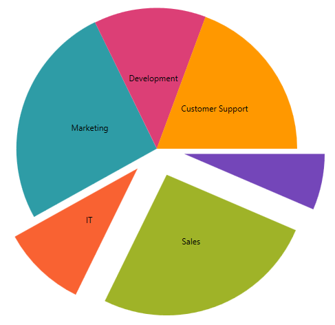

////
|metadata|
{
    "name": "piechart-selection-and-explosion",
    "controlName": ["{PieChartName}"],
    "tags": ["Charting","Data Presentation","How Do I"],
    "guid": "0e363f90-9f23-46d4-86db-151915650724",
    "buildFlags": ["SL","WPF","win-phone","WINFORMS","ANDROID","XAMARIN"],
    "createdOn": "2014-06-05T19:53:12.0788999Z"
}
|metadata|
////

= Selection and Explosion

This topic demonstrates how to implement the explosion behavior of the link:{PieChartLink}.{PieChartName}.html[{PieChartName}]™ control. At the end of the topic, a complete code sample is provided.

The topic is organized as follows:

* <<Introduction,Introduction>>
* <<Preview,Preview>>
* <<Requirements,Requirements>>
* <<Overview,Overview>>
* <<Steps,Steps>>
* <<Complete,Complete Code Sample>>

ifdef::xaml,android[]
** <<View,View>>

endif::xaml,android[]

** <<CodeBehind,Code Behind>>

* <<RelatedTopics,Related Topics>>

[[Introduction]]
== Introduction

The Pie Chart control supports explosion of individual pie slices as well as a link:{PieChartLink}.{PieChartBase}~sliceclick_ev.html[SliceClick] event that allows you to modify selection states and implement custom logic.

[[Preview]]
== Preview

ifdef::xaml[]

endif::xaml[]

ifdef::win-forms[]
image::images/piechart-explosion.PNG[]
endif::win-forms[]

Figure 1: The {PieChartName} control as implemented by the sample code

[[Requirements]]
== Requirements

This article assumes you have already read the link:piechart-data-binding.html[Data Binding] topic, and uses the code therein as a starting point.

[[Overview]]
== Overview

[start=1]
. Configuring the respective properties and event handler
[start=2]
. Implementing the event handler
[start=3]
. (Optional) Verifying the result

[[Steps]]
== Steps

[start=1]
. *Configure the respective properties and event handler* .

Taking code from the link:piechart-data-binding.html[Data Binding] topic as a starting point, enable explosion by setting the link:{PieChartLink}.{PieChartBase}{ApiProp}allowsliceexplosion.html[AllowSliceExplosion] property to True and configure pieChart_SliceClick as the event handler for mouse clicks:

pick:[xaml="*In XAML:*"]

ifdef::xaml[]
----
<ig:{PieChartName} Name="pieChart"
                   AllowSliceExplosion="True"
                   SliceClick="pieChart_SliceClick" />
----
endif::xaml[]

pick:[win-forms="*In C#:*"]

ifdef::win-forms[]
----
var pieChart = new UltraPieChart
            {
                Dock = DockStyle.Fill,
                LabelMemberPath = "Label",
                ValueMemberPath = "Value",
                AllowSliceExplosion="True",
                DataSource = new Data(),
            };
            this.Controls.Add(pieChart);
----
endif::win-forms[]

pick:[win-forms="*In VB:*"]

ifdef::win-forms[]
----
Dim pieChart = New UltraPieChart() With
 { _
            .Dock = DockStyle.Fill, _
            .LabelMemberPath = "Label", _
            .ValueMemberPath = "Value", _
            .AllowSliceExplosion = "True", _
            .DataSource = New Data() _
                }
----
endif::win-forms[]

[start=2]
. *Implement the event handler* .

On SliceClick, toggle the explosion states of the slice. 

ifdef::xaml[]
*In C#:*

----
private void pieChart_SliceClick(object sender, {PieChartNamespace}.SliceClickEventArgs e)
{
   e.IsExploded = !e.IsExploded;
}
----

endif::xaml[]

ifdef::xaml[]
*In Visual Basic:*

----
Private Sub pieChart_SliceClick(sender As Object, e As {PieChartNamespace}.SliceClickEventArgs)            
   e.IsExploded = Not e.IsExploded            
 Next        
End Sub
----

endif::xaml[]

ifdef::win-forms[]

*In C#:*

----
void pieChart_SliceClick(object sender, SliceClickEventArgs e)
       {
           UltraPieChart pieChart = sender as UltraPieChart;
           e.IsExploded = !e.IsExploded;
       }
----

*In Visual Basic:*

----
Private Sub pieChart_SliceClick(sender As Object, e As SliceClickEventArgs)
       Dim pieChart As UltraPieChart = TryCast(sender, UltraPieChart)
       e.IsExploded = Not e.IsExploded
       e.IsSelected = Not e.IsSelected
       Me.ultraLabel1.Text = "Selected Slices:" + Environment.NewLine
       For Each index As Integer In pieChart.SelectedSlices
           Dim label As String = DirectCast(pieChart.DataSource, ObservableCollection(Of DataItem))(index).Label
           Me.ultraLabel1.Text += label + Environment.NewLine
       Next
   End Sub
----

endif::win-forms[]

[start=3]
. *(Optional) Verify the result* .

To verify the result, run your application. The Pie Chart control will now respond to SliceClick events by selecting and exploding the appropriate slice outward. A list of currently selected slices will also be maintained in the upper left corner. (Figure 1, above)

[[Complete]]
== Complete Code Sample

The following code listings contain the full example implemented in context.

[[View]]

ifdef::xaml[]
== View

----
<UserControl x:Class="{PieChartName}_SelectAndExplode.MainPage"
    xmlns="http://schemas.microsoft.com/winfx/2006/xaml/presentation"
    xmlns:x="http://schemas.microsoft.com/winfx/2006/xaml"
    xmlns:d="http://schemas.microsoft.com/expression/blend/2008"
    xmlns:mc="http://schemas.openxmlformats.org/markup-compatibility/2006"
    xmlns:ig="http://schemas.infragistics.com/xaml"
    xmlns:ig="clr-namespace:{PieChartNamespace};assembly={ApiPlatform}{PieChartAssembly}{ApiVersion}"    xmlns:local="clr-namespace:{PieChartName}_PieOfPie"
    mc:Ignorable="d"
    d:DesignHeight="300" d:DesignWidth="400">
    <Grid x:Name="LayoutRoot" Background="White">
        <Grid.Resources>
            <local:Data x:Key="data" />
        </Grid.Resources>
        <ig:ItemLegend Name="Legend"
                       VerticalAlignment="Top"
                       HorizontalAlignment="Right"  
                       Margin="10"
                       Padding="10,5,10,5"
                       />
        <ig:{PieChartName} Name="pieChart"
                        ItemsSource="{StaticResource data}"
                        LabelMemberPath="Label"
                        ValueMemberPath="Value"
                        ToolTip="{}{Label}"
                        LabelsPosition="BestFit"
                        Legend="{Binding ElementName=Legend}"
                        AllowSliceExplosion="True"
                        SliceClick="pieChart_SliceClick"
                        />
    </Grid>
</UserControl>
----
endif::xaml[]

[[CodeBehind]]
== Code-Behind

ifdef::xaml[]
*In C#:*

----
using System;
using System.Collections.ObjectModel;
using System.Windows.Controls;
namespace {PieChartName}_SelectAndExplode
{
    public partial class MainPage : UserControl
    {
        public MainPage()
        {
            InitializeComponent();
        }
        private void pieChart_SliceClick(object sender, {PieChartNamespace}.SliceClickEventArgs e)
        {
            e.IsExploded = !e.IsExploded;
        }
    }
    public class DataItem
    {
        public string Label { get; set; }
        public double Value { get; set; }
    }
    public class Data : ObservableCollection<DataItem>
    {
        public Data()
        {
            Add(new DataItem { Label = "Administration", Value = 20 });
            Add(new DataItem { Label = "Sales", Value = 80 });
            Add(new DataItem { Label = "IT", Value = 30 });
            Add(new DataItem { Label = "Marketing", Value = 80 });
            Add(new DataItem { Label = "Development", Value = 40 });
            Add(new DataItem { Label = "Customer Support", Value = 60 });
        }
    }
}
----
*In Visual Basic:*

----
Imports System
Imports System.Collections.ObjectModel
Imports System.Windows.Controls
Namespace {PieChartName}_SelectAndExplode
    Public Partial Class MainPage
        Inherits UserControl
        Public Sub New()
            InitializeComponent()
        End Sub
        Private Sub pieChart_SliceClick(sender As Object, e As {PieChartNamespace}.SliceClickEventArgs)
            e.IsExploded = Not e.IsExploded
        End Sub
    End Class
    Public Class DataItem
        Public Property Label() As String
            Get
                Return _Label
            End Get
            Set
                _Label = Value
            End Set
        End Property
        Private _Label As String
        Public Property Value() As Double
            Get
                Return _Value
            End Get
            Set
                _Value = Value
            End Set
        End Property
        Private _Value As Double
    End Class
    Public Class Data
        Inherits ObservableCollection(Of DataItem)
        Public Sub New()
            Add(New DataItem() With { _
                .Label = "Administration", _
                .Value = 20 _
            })
            Add(New DataItem() With { _
                .Label = "Sales", _
                .Value = 80 _
            })
            Add(New DataItem() With { _
                .Label = "IT", _
                .Value = 30 _
            })
            Add(New DataItem() With { _
                .Label = "Marketing", _
                .Value = 80 _
            })
            Add(New DataItem() With { _
                .Label = "Developement", _
                .Value = 40 _
            })
            Add(New DataItem() With { _
                .Label = "Customer Support", _
                .Value = 60 _
            })
        End Sub
    End Class
End Namespace
----
endif::xaml[]

ifdef::win-forms[]

*In C#:*

----
public partial class Form1 : Form
{
    public Form1()
    {
        InitializeComponent();
    }
    UltraPieChart pieChart;
    UltraItemLegend legend;
    private void Form1_Load(object sender, EventArgs e)
    {        
        pieChart = new UltraPieChart
        {
            Dock = DockStyle.Fill,
            LabelMemberPath = "Label",
            ValueMemberPath = "Value",
            DataSource = new Data(),
        };
        this.Controls.Add(pieChart);
        legend = new UltraItemLegend
        {             
            Dock = DockStyle.Right,   
            Height = 500
        };
        this.Controls.Add(legend);
        this.pieChart.Legend = legend;
        this.legend.BringToFront();
        pieChart.OthersCategoryThreshold = 2;
        pieChart.OthersCategoryType = OthersCategoryType.Number;
        pieChart.OthersCategoryText = "Others";
        pieChart.SliceClick += pieChart_SliceClick;
    }
    void pieChart_SliceClick(object sender, SliceClickEventArgs e)
    {
        UltraPieChart pieChart = sender as UltraPieChart;
        e.IsExploded = !e.IsExploded;
    }
}
public class DataItem
{
    public string Label { get; set; }
    public double Value { get; set; }
}
public class Data : ObservableCollection<DataItem>
{
    public Data()
    {
        Add(new DataItem { Label = "Item 1", Value = 5 });
        Add(new DataItem { Label = "Item 2", Value = 6 });
        Add(new DataItem { Label = "Item 3", Value = 3 });
        Add(new DataItem { Label = "Item 4", Value = 7 });
        Add(new DataItem { Label = "Item 5", Value = 1 });
        Add(new DataItem { Label = "Item 6", Value = 1 });
        Add(new DataItem { Label = "Item 7", Value = 1 });
        Add(new DataItem { Label = "Item 8", Value = 1 });
        Add(new DataItem { Label = "Item 9", Value = 1 });
    }
}
----

*In Visual Basic:*

----
Partial Public Class Form1
    Inherits Form
    Public Sub New()
        InitializeComponent()
    End Sub
    Private pieChart As UltraPieChart
    Private legend As UltraItemLegend
    Private Sub Form1_Load(sender As Object, e As EventArgs)
                        pieChart = New UltraPieChart() With { _
                                .Dock = DockStyle.Fill, _
                                .LabelMemberPath = "Label", _
                                .ValueMemberPath = "Value", _
                                .DataSource = New Data() _
                        }
        Me.Controls.Add(pieChart)
        Me.ultraLabel1.BringToFront()
                        legend = New UltraItemLegend() With { _
                                .Dock = DockStyle.Right, _
                                .Height = 500 _
                        }
        Me.Controls.Add(legend)
        Me.pieChart.Legend = legend
        Me.legend.BringToFront()
        pieChart.OthersCategoryThreshold = 2
        pieChart.OthersCategoryType = OthersCategoryType.Number
        pieChart.OthersCategoryText = "Others"
        AddHandler pieChart.SliceClick, AddressOf pieChart_SliceClick
    End Sub
    Private Sub pieChart_SliceClick(sender As Object, e As SliceClickEventArgs)
        Dim pieChart As UltraPieChart = TryCast(sender, UltraPieChart)
        e.IsExploded = Not e.IsExploded
    End Sub
End Class
Public Class DataItem
    Public Property Label() As String
        Get
            Return m_Label
        End Get
        Set(value As String)
            m_Label = Value
        End Set
    End Property
    Private m_Label As String
    Public Property Value() As Double
        Get
            Return m_Value
        End Get
        Set(value As Double)
            m_Value = Value
        End Set
    End Property
    Private m_Value As Double
End Class
Public Class Data
    Inherits ObservableCollection(Of DataItem)
    Public Sub New()
                        Add(New DataItem() With { _
                                .Label = "Item 1", _
                                .Value = 5 _
                        })
                        Add(New DataItem() With { _
                                .Label = "Item 2", _
                                .Value = 6 _
                        })
                        Add(New DataItem() With { _
                                .Label = "Item 3", _
                                .Value = 3 _
                        })
                        Add(New DataItem() With { _
                                .Label = "Item 4", _
                                .Value = 7 _
                        })
                        Add(New DataItem() With { _
                                .Label = "Item 5", _
                                .Value = 1 _
                        })
                        Add(New DataItem() With { _
                                .Label = "Item 6", _
                                .Value = 1 _
                        })
                        Add(New DataItem() With { _
                                .Label = "Item 7", _
                                .Value = 1 _
                        })
                        Add(New DataItem() With { _
                                .Label = "Item 8", _
                                .Value = 1 _
                        })
                        Add(New DataItem() With { _
                                .Label = "Item 9", _
                                .Value = 1 _
                        })
    End Sub
End Class
----
endif::win-forms[]

[[RelatedTopics]]
== Related Topics

* link:piechart-data-binding.html[Data Binding]
* link:piechart-selection.html[Selection]
* link:piechart-others-category.html[Others Category]