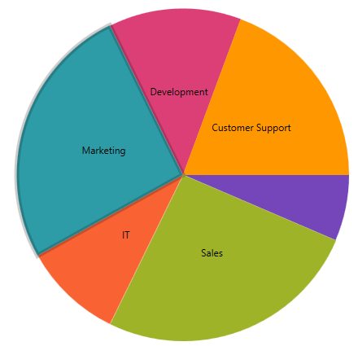
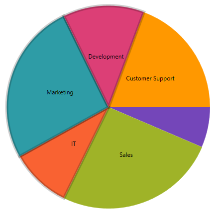

= Selection

This topic provides information for enabling and using the selection feature in the link:{PieChartLink}.{PieChartName}.html[{PieChartName}]™ control. 

The topic contains the followning sections:

* <<Requirements,Requirements>>
* <<Overview,Overview>>
* <<EnablingSelection,Enabling Selection>>
* <<SelectionModes,Selection Modes>>
* <<SelectionEvents,Selection Events>>
* <<SelectingOthers,Selecting the Others Slices>>
* <<RelatedTopics,Related Topics>>

[[Requirements]]
== Requirements

This article assumes you have already read the link:piechart-data-binding.html[Data Binding] topic, and uses the code therein as a starting point.

[[Overview]]
== Overview

The Pie Chart supports slice selection by mouse click as the default behavior. You can determine the selected slices by using the link:{PieChartLink}.{PieChartBase}{ApiProp}SelectedItem.html[SelectedItem] property. The selected slice is highlighted as demonstrated in the following image:

[[EnablingSelection]]
== Enabling Selection

There is a property called link:{PieChartLink}.{PieChartBase}{ApiProp}SelectionMode.html[SelectionMode] which is how you set what mode you want the pie chart to use.  The default is “Single”.  In order to disable selection, set the property to “Manual”.  

the following code snippet demonstrates how to disable selection.

ifdef::xaml[]
*In XAML:*

----

<ig:XamPieChart x:Name=”pieChart” SelectionMode=”Manual” … />

----
endif::xaml[]

*In Visual Basic:*

----

pieChart.SelectionMode = SliceSelectionMode.Manual

----

*In C#:*

----

pieChart.SelectionMode = SliceSelectionMode.Manual; 

----

[[SelectionModes]]
== Selection Modes

The pie chart supports three different selection modes.  

* Single
* Multiple
* Manual

=== Single

When the mode is set to single, only one slice can be selected at a time.  When you select a new slice the previously selected slice will be deselected and the new one will become selected.

=== Multiple

When the mode is set to Multiple, many slices can be selected at once.  If you click on a slice, it will become selected and clicking on a different slice will also select that slice leaving the previous slice selected.

=== Manual 

When the mode is set to Manual, selection is disabled.

[[SelectionEvents]]
== Selection Events

The pie chart has 4 events associated with selection:

* link:{PieChartLink}.{PieChartBase}{ApiProp}SelectedItemChanging_ev.html[SelectedItemChanging]
* link:{PieChartLink}.{PieChartBase}{ApiProp}SelectedItemChanged_ev.html[SelectedItemChanged]
* link:{PieChartLink}.{PieChartBase}{ApiProp}SelectedItemsChanging_ev.html[SelectedItemsChanging]
* link:{PieChartLink}.{PieChartBase}{ApiProp}SelectedItemsChanged_ev.html[SelectedItemsChanged]

The events that end in “Changing” are cancelable events which means you can stop the selection of a slice by setting the event argument property “Cancel” to true.  When set to true the associated property will not update and the slice will not become selected.  This is useful for scenarios where you want to keep users from being able to select certain slices based on the data inside it.

ifdef::xaml[]
*In XAML:*

----

<ig:XamPieChart x:Name=”pieChart” SelectedItemChanging=”pieChart_SelectedItemChanging” ... />

----
endif::xaml[]
 
*In Visual Basic:*

----

Private Sub pieChart_SelectedItemChanging(sender As Object, e As SelectedItemChangingEventArgs)
	e.Cancel = True
End Sub

----
 
*In C#:*

----

pieChart.SelectedItemChanging += pieChart_SelectedItemChanging;
void pieChart_SelectedItemChanging(object sender, SelectedItemChangingEventArgs e)
{
    e.Cancel = true;
}

----

[[SelectingOthers]]

== Selecting the Others Slice

For scenarios where you click on the Others slice, the pie chart will return an object called link:{ApiPlatform}{DataChartAssembly}{ApiVersion}{ApiProp}infragistics.controls.charts.piesliceotherscontext.html[PieSliceOthersContext].  This object contains a list of the data items contained within the Others slice.

[[RelatedTopics]]
== Related Topics

* link:piechart-data-binding.html[Data Binding]
* link:piechart-others-category.html[Others Category]