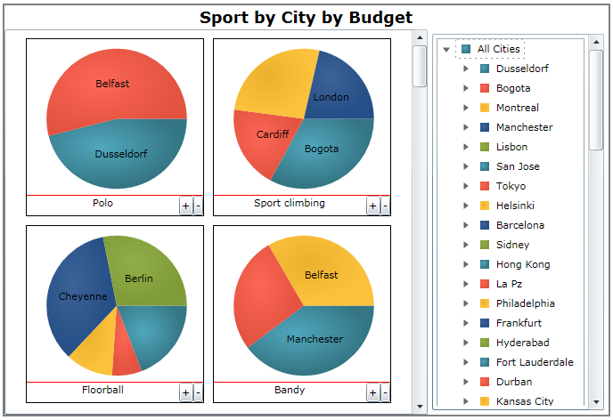

////
|metadata|
{
    "name": "piechart-visualizing-olap-data-piechart",
    "controlName": ["{PieChartName}"],
    "tags": ["Charting","Getting Started","Layouts"],
    "guid": "4e57828c-18e0-4f62-b8df-6c25594619e0",
    "buildFlags": ["SL","WPF"],
    "createdOn": "2014-06-05T19:53:12.0839017Z"
}
|metadata|
////

= Visualizing OLAP Data

=== Introduction

This section explains the specifics of using the link:{PieChartLink}.{PieChartName}.html[{PieChartName}]™ control with OLAP data. The multiple pie charts in the layout indicate the columns while the pie slices are the rows of data that contain values.

=== Topics

Refer to the following topics for more detailed information on Visualizing OLAP Data:

* link:piechart-binding-olap-data.html[Binding OLAP Data]
* link:piechart-user-interactions-with-olap-data.html[User Interactions with OLAP Data]