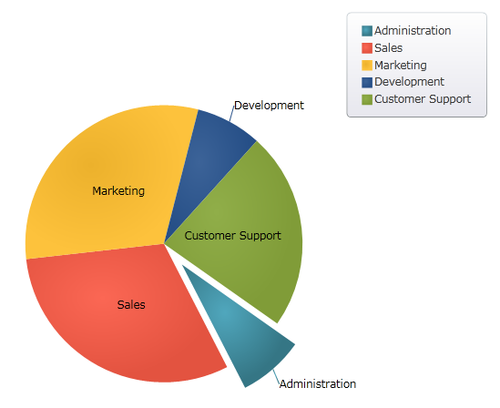
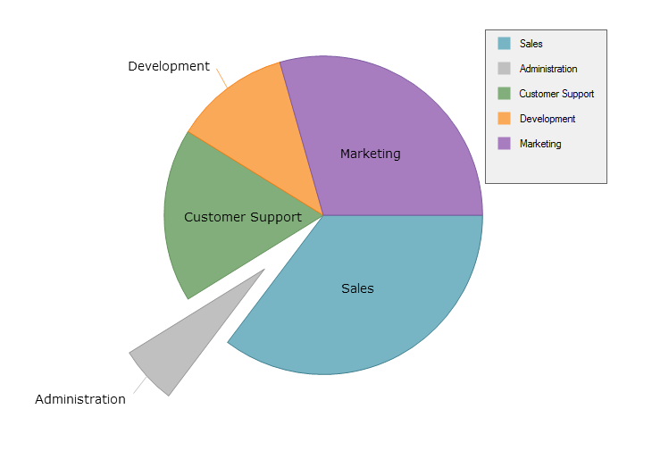

////
|metadata|
{
    "name": "piechart",
    "controlName": ["{PieChartName}"],
    "tags": ["Getting Started"],
    "guid": "7327342b-32f9-4a1e-b74a-3d4163b47378",
    "buildFlags": ["SL","WPF","win-phone","XAMARIN","ANDROID","WINFORMS"],
    "createdOn": "2014-06-05T19:53:12.0688959Z"
}
|metadata|
////

= {PieChartName}

The link:{PieChartLink}.{PieChartName}.html[{PieChartName}]™ is a specialized control that renders a pie chart, consisting of a circular area divided into sections. Each section has arc length proportional to its underlying data value.

ifdef::xaml,android[]

endif::xaml,android[]

ifdef::win-forms[]

endif::win-forms[]

Figure 1: A sample {PieChartName} control

The {PieChartName} control is used for representing categorical data. It is most effective when there are only a few categories, and when each category makes up a relatively large percentage of the data as a whole.

The {PieChartName} control ships with the Data Chart assembly.

== link:piechart-getting-started-with-piechart.html[Getting Started with {PieChartName}]

In order to get you up and running as quickly as possible with the {PieChartName} control, we've provided you with information on how to get started using the control.

== link:piechart-using-piechart.html[Configuring {PieChartName}]

This section contains information on the key features and functionalities provided by the {PieChartName} control.

== link:piechart-api-overview.html[API Overview]

This topic lists the namespaces and classes that you will be working with while programming with the {PieChartName} control.